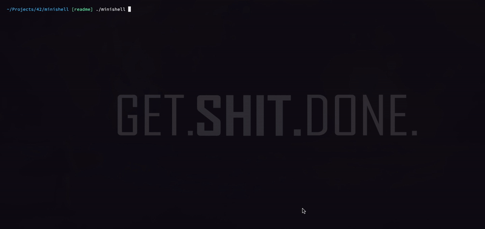

# minishell

### TOC

* [What is minishell?](#what-is-it-about)
* [Usage](#how-does-it-work)
* [Author](#author)
* [License](#license)
* [Dependencies](#dependencies)

#### Part of [42 SV][42] school curriculum.
Creator: 42 staff. [Task description][pdf]

## What is it about?

Minishell is a simple unix command line interpreter, also including several built in shell functions. Such as:

* echo
* cd
* env
* setenv
* unsetenv
* exit

During the development I used `bash` and `csh` terminals as a reference.
Additional features:

- Signal handling(ctrl-C, ctrl-D).
- Colors.
- Multi command support(separated by `;`).
- Advanced quotes support. Weak/strong quotes expantion. Managing correct quotes input.
- Using errno for correct error management.

## How does it work?

### Building
Download and compile the repo:
```sh
    git clone https://github.com/IvanKozlov95/minishell
    cd minishell
    make
```
Executable *minishell* will be created.
### Using
Launch *minishell* executable. Minishell will be launched inside of your terminal.
Feel free to go around and have fun. It supports all shell commands without anything advanced. So no pipes and redirections. However commands can be separated by `;`.

</img>

## Author
This project was developed by Ivan Kozlov [@ivankozlov95][me].

## License
This project is licensed under the [Apache License][license].

## Dependencies

This project heavily dependent on my c library [libft][libft].

[42]: http://42.us.org "42 USA"
[me]: https://github.com/IvanKozlov95 "ivankozlov95"
[pdf]: https://github.com/IvanKozlov95/fillit/blob/master/resources/filler.en.pdf
[libft]: https://github.com/IvanKozlov95/libft "libft"
[license]: https://github.com/IvanKozlov95/minishell/blob/master/LICENSE "license"